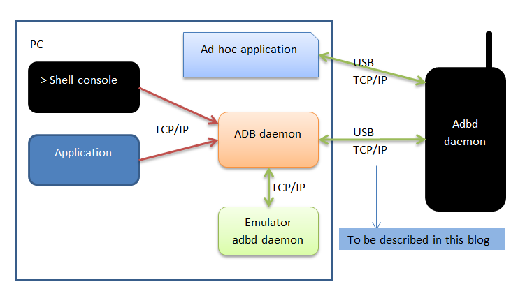

# 由云测平台引发的思考
相信很多人都用过 testin, testBird等云测平台的远程真机调试功能, 确实非常好用, 但也由此引发了我3个技术方面的疑问:
1. adb connect ip:port 是如何实现连接远程设备的?
2. 实时画面如何采集, 以及屏幕点击事件如何回传到设备?
3. Android 远程操控的实现原理?

对于问题一:
我们都知道可以通过以下方式实现通过局域网 wifi 与设备连接:
1. 手机开启开发者模式, 并打开 usb 调试, 然后用usb线与电脑连接;
2. 在电脑终端输入 `adb tcpip 5555` 命令, 重启手机 adbd 服务, 并监听5555端口;
3. 拔掉手机usb, 查看手机ip, 比如是(192.168.1.100)
4. 在电脑终端输入 `adb connect 192.168.1.100` 与手机连接, `adb devices` 查看是否连接成功.

单单实现以上实际并没有太多意义.
那么再把这个场景扩大一下, 电脑A(192.168.1.10)和B(192.168.1.20)在同一个局域网, 手机 usb连接A, 那么B 的adb client 如何通过 A 连接到手机.

经过调研发现已有类似云测平台远程真机调试的开源方案: `openstf`. 当然据说各家云测平台也都是参考的这个开源项目的实现;

# Refs.
云测平台远程真机调试开源方案参考资料:
- [openstf](https://github.com/openstf/stf)
- [openstf官网](https://openstf.io/)
- [美团点评云真机平台实践](https://juejin.im/post/5b5556eae51d45195f0b3422)
- [安卓设备集群管理 atx-server](https://testerhome.com/topics/11546)
- [atxserver2](https://github.com/openatx/atxserver2)
- [scrcpy](https://github.com/Genymobile/scrcpy)

adb 参考资料

上面的图分为两部分，第一部分完全是发生在电脑上的。其实就是一台电脑上的socket通信。而第二部分就是电脑和手机之间的socket通信了，这里解释一下这三个东西。

  1)adb进程，当我们在执行任何命令的时候都会启动一个adb进程。比如adb devices。这里启动了一个adb进程，传递了一个命令行(devices)。这个进程执行完devices命令之后会退出。也就是说执行一个命令会启动一下adb进程，命令执行完之后adb进程就退出了。

  2)adb服务进程。这个进程在电脑上最多只有一个。是用来接收adb发过来的命令的，必要的时候转发给手机的adbd进程。无论你电脑安装了多少个助手，也只会有启动一个。并且一般情况下，启动之后就会驻留，不会主动退出。正式由于这个服务进程有且最多只能有一个，所以现在所有的助手都在抢这个入口，谁把自己当成了服务进程，谁就有了很多权利。最无耻的莫过于360的手机助手。干掉别人，成就自己。而且还做很多龌龊的事情。这个进程可以当成是一个server，监听本地5037端口。

3)手机的adbd进程，adb服务进程接受到命令之后，大部分的命令都会转发给手机的这个进程，因为adb服务进程并不能完成工作，而是需要手机的进程来协同完成。这个就不需要太多的关注了。

- [ADB工具原理探究](https://itimetraveler.github.io/2019/06/07/Android%20ADB%E5%8E%9F%E7%90%86%E6%8E%A2%E7%A9%B6/)
- [awesome-adb](https://github.com/mzlogin/awesome-adb)
  >  ADB Usage Complete / ADB 用法大全
- [adb源码](https://github.com/aosp-mirror/platform_system_core/tree/master/adb)
- [adb协议](https://github.com/aosp-mirror/platform_system_core/blob/master/adb/SERVICES.TXT)
- [Android ADB Protocols](http://blogs.kgsoft.co.uk/2013_03_15_prg.htm)
    > adb 协议解析
- [ADB原理，Wi-Fi连接，常用命令及拓展](https://juejin.im/post/5b029ce951882542816a9e46)
- [单独使用 STF 中的 adb connect 功能](https://testerhome.com/topics/8049)
- [adbkit](https://github.com/openstf/adbkit)

# 远程操控
