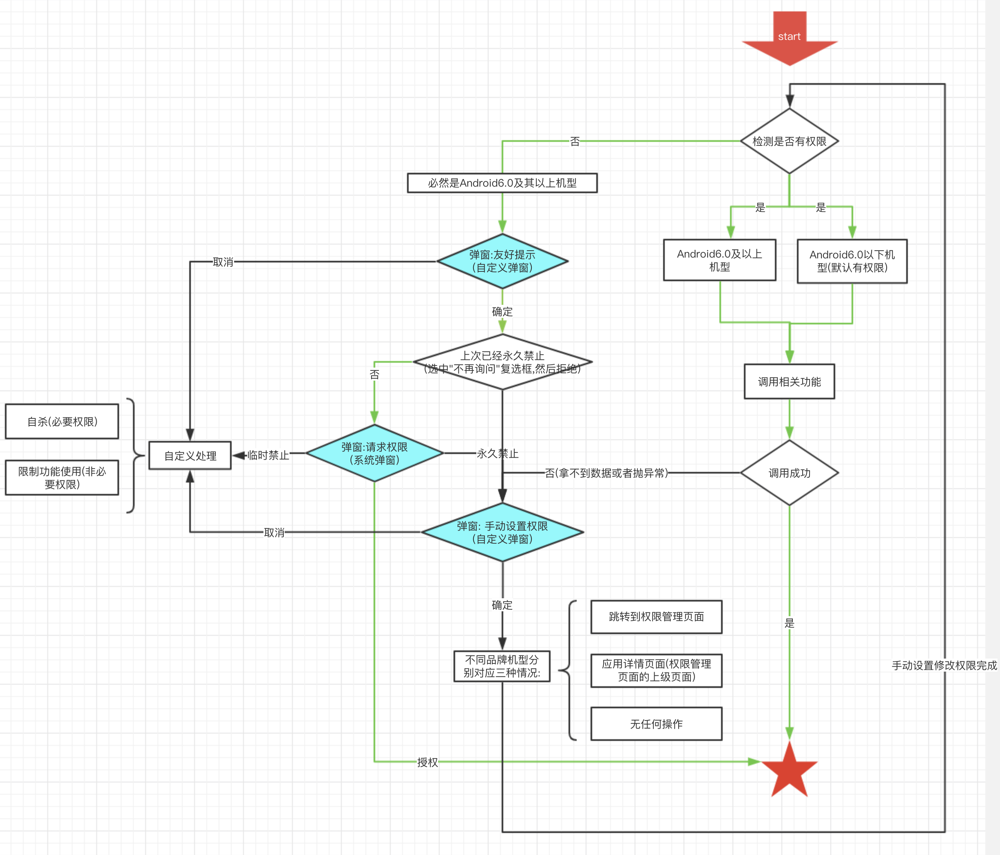

动态权限(常用)
- 摄像头
- GPS
- 通讯录/短信/通话记录/IMEI

## 权限有四种状态
- 允许
- 临时禁止(未选中"不再提醒")
- 永久禁止(选中"不再提醒")
- 询问

## 原生动态权限管理机制
调用相关功能前要先请求权限; 若没有权限而且不请求权限, 直接调用相关API会抛出异常;

## 特殊机型列举
### vivo
系统全面接管动态权限管理.包括6.0以上机型在内, 都没有采用原生的动态权限管理机制.
通过 ```ContextCompat.checkSelfPermission(context, permissionLists.get(i)) == PackageManager.PERMISSION_GRANTED)``` 方式校验是否获得权限,全部返回true.

只有在调用相关业务代码时才由系统弹出权限请求弹窗; 但是不会抛出异常;
- 对于拍照权限, 在调用摄像头时, 如果用户没有允许, 系统都会弹窗询问; (权限处于禁止或询问状态)
- 对于其他权限, 用户禁止, 并且选中了不再询问, 系统不再弹窗; (权限处于禁止状态)

### meizu
系统弹窗无"不再提醒"复选框, 所以点击拒绝即为永久禁止

## 权限管理流程

以微博为例, 解释以上流程图中涉及到的3类弹窗:


## 附录:
- [android.developer官网: 权限最佳做法](https://developer.android.google.cn/training/permissions/best-practices#testing)
- [android.developer官网: 系统权限](https://developer.android.com/guide/topics/security/permissions?hl=zh-cn)